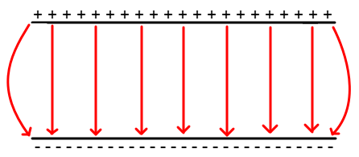
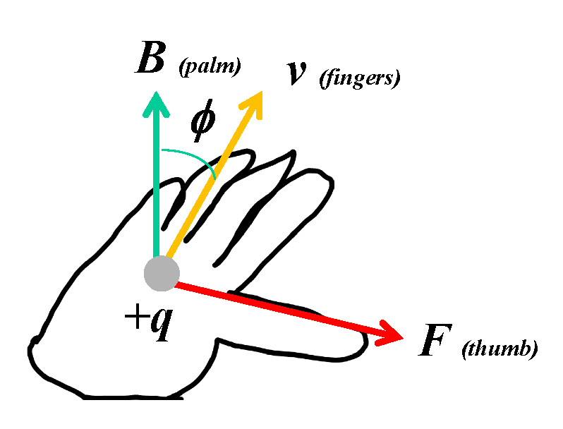
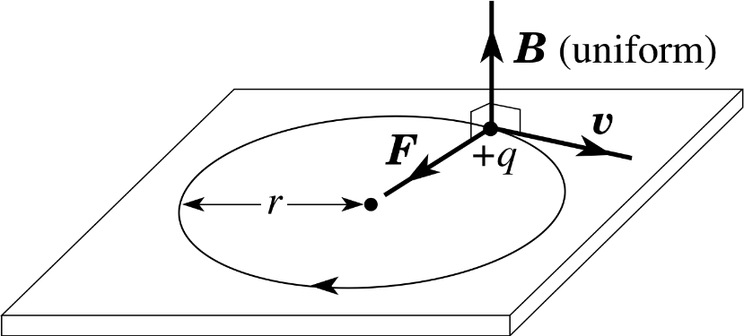
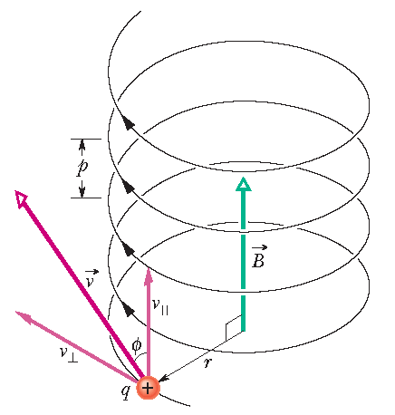

Charged Particles, Conductors and Electric and Magnetic Fields
==============================================================

.. admonition:: Syllabus Excerpt

   **Inquiry Question:** What happens to stationary and moving charged particles when they interact with an electric or magnetic field?

   * investigate and quantitatively derive and analyse the interaction between charged particles and uniform electric fields, including: (ACSPH083)  

     * electric field between parallel charged plates $E = \frac{V}{d}$

     * acceleration of charged particles by the electric field $\vec{F}_{net} = m\vec{a}$, $\vec{F} = q\vec{E}$

     * work done on the charge $W=qV$, $W=qEd$, $K=\frac{1}{2}mv^2$

   * model qualitatively and quantitatively the trajectories of charged particles in electric fields and compare them with the trajectories of projectiles in a gravitational field    

   * analyse the interaction between charged particles and uniform magnetic fields, including: (ACSPH083)

     * acceleration, perpendicular to the field, of charged particles

     * the force on the charge $F=qv_{\perp}B=qvB\sin\theta$

   * compare the interaction of charged particles moving in magnetic fields to: 

     * the interaction of charged particles with electric fields

     * other examples of uniform circular motion (ACSPH108)

    |syllabus-nesa|_

 
An *electric field* is a region where a charged particle will experience a force.
By convention, the *direction* of the field is the direction of the force which acts on a positive test charge inside the field.
This produces a direction that goes from positive charges to negative charges.

.. list-table::
    :width: 90%
    :align: center

    * - Negative Point Charge
      - Positive Point Charge

    * - .. image:: images/negative-point-charge.png
           :alt: Negative Point Charge
      - .. image:: images/positive-point-charge.png
           :alt: Positive Point Charge

    * - Pair of Unlike Charges
      - Pair of Like Charges

    * - .. image:: images/pair-unlike-charges.png
           :alt: Pair of Unlike Charges
      - .. image:: images/pair-like-charges.png
           :alt: Pair of Like Charges

The density of the field lines indicates the electric field strength. 
The more dense the lines, the stronger the electric field.

Uniform Electric Fields can be created between two parallel plates:

*Electric potential* is seen through *equipotential lines* (or surfaces in 3D).
All points on an equipotential have the same electric potential.
No work is done moving along equipotential lines, online between them.
Equipotential lines are always perpendicular to field direction.

.. warning::
    These are not field lines!
    The diagrams above are not equipotentials.

Electric Field Strength Between Parallel Plates
-----------------------------------------------

.. math::

  \begin{array}{ll}
    E = \frac{V}{d} & F = \frac{q}{E}
  \end{array}

.. math::

  \begin{array}{llll}
    E & \text{Electric Field Strength (V$m^{-1}$ or N$C^{-1}$)} & & \\
    V & \text{Potential Difference (V)} & d & \text{Distance between plates (m)} \\
    F & \text{Force (N)} & q & \text{Charge (C)} \\
  \end{array}

The electric field strength is constant between parallel plates, so forth is the Force and thus acceleration of charged particles.
Particles only experience acceleration in the direction of the field.
This means that if there is velocity perpendocular t othe field line sit remains remains unaccelerated and hence a parabolic trajectory is formed.

The force on a charged particle is proportional to the charge and the field strength.
This means that negative charges will experience a force opposing the direction of field.

Work Done on a Charge
---------------------
The total work done depend on the displacement of the particle not the distance.

When a positive charge is moving in the direction of the field, *positive* work is done **by** the field and the electric potential decreases.
When a positive charge moves against the field, *negative* work is done by the field (so work is done **on** the field), and the electirc potential increases.
... and vice versa for negative charges.

From $F=qE$ and $W=Fd$ we can derive the following equations for work:

.. math::

  \begin{array}{ll}
    W = qEd & W = qV
  \end{array}

.. math::

  \begin{array}{llll}
    F & \text{Force (N)} & q & \text{Charge (C)} \\
    V & \text{Potential Difference (V)} & d & \text{Distance moved (m)} \\
    E & \text{Electric Field Strength (V$m^{-1}$ or N$C^{-1}$)} & & \\
  \end{array}

If a charge is accelerated from rest, then $E_k = W = \frac{1}{2}mv^2 = qV$.

Trajectories Between Plates
---------------------------

A charged particle in an electric field will experience a force towards the oppositely charged plate.
As $F = qE = ma$ and the field strength is uniform, there is *constant acceleration*, which produces a parabola.

The acceleration will be $a = \frac{qE}{m}$.

Magnetic Fields
---------------

Magnetic fields go from north poles to south poles. 
Current-carrying conducts will have a circular current as according to the RHG rule.

Within a solenoid, the field goes from the south to the north pole.
The direction of current around the conductor is also given by the RHG rule.

Charged particles **moving** within a magnetic field will experience a force within the field.
The direction of the force on a *positive* charge is given by the right hand grip rule, where:

* Palm points in direction of field
* Fingers point in direction of the movement
* The thumb points in the direction of force.

Negative charges will experience the force in the opposite direction.

.. Image is from PDF, edit that!

   Modified From `Dr Xiaojun Wang's 20 Magnetic Fields & Forces <http://bec01.phy.georgiasouthern.edu/xwang/teaching/YG20.ppt>`_

An interactive illustration of this is provided in this `GeoGebra File <../_static/magnetic-field-direction.ggb>`_.

The magnetic of the force produced by the magnetic field is given by:

.. math::

  \begin{array}{ll}
    F_B = qv_{\perp}B & F_B = qvB\sin\theta
  \end{array}

.. math::

  \begin{array}{llll}
    F_B & \text{Magnetic Force (N)} & q & \text{Charge (C)} \\
    v & \text{Velocity (m$s^{-1}$)} & \theta & \text{Between v and B (dimensionless)} \\
    B & \text{Magnetic Field Strength (T)} & & \\
  \end{array}
  

The force produced is orthogonal ("perpendicular") to the plane produced through both the v and B vectors.
Hence, as the force is perpendicular to the direction of motion, it causes uniform circular motion.

We can then use $F_B = F_C$ to derive an expression for $r$.

.. math::

  \begin{align*}
    F_B &= F_C \\
    q \cancel{v_{\perp}} B &= \frac{mv_{\perp}^{ \cancel{2} }}{r} \\
    qB &= \frac{mv_{\perp}}{r} \\
    r &= \frac{mv_{\perp}}{qB} 
  \end{align*}

   From `Whitesides Research Group, Harvard <https://gmwgroup.harvard.edu/lorenz-effects>`_

A charge entering a (**3-dimensional**) field at an angle not parallel or perpendicular to the field, it moves helically.

.. todo:: EXPLAIN THIS WELL! - show a question

The velocity can be broken into two parts:

- **perpendicular component** ($v_{\perp}$) - this velocity gets affected by the field and produces circular motion
- **parallel component** ($v_{\parallel}$) - this remains unaccelerated by the field, and produces the movement that produces a "helix"
  This makes the distance between successive circles (i.e. the "pitch") remains constant.

   From Fundamentals of Physics, Halliday and Resnick [10 ed], pg. 816

Comparison of Interactions of Magnetic and Electric Fields
----------------------------------------------------------

.. list-table::
   :align: center

   * - **Feature**
     - **Electric Field**
     - **Magnetic Field**
   * - **Equation of Force**
     - .. math:: F = qE
     - .. math:: F = qv_{\perp}B
   * - **Direction of Force**
     - The force acts along the field
     - The force acts orthogonal to the field and direction of movement
   * - **Condition for Force on Charge**
     - Experiences a force regardless of velocity
     - Requires a velocity perpendicular to the field
   * - **Trajectory of a Charge in the field**
     - Produces a parabolic trajectory as velocity parallel to field experiences constant force.
     - Produces a circular trajectory as a force is directed to the centre of motion in a uniform B field.