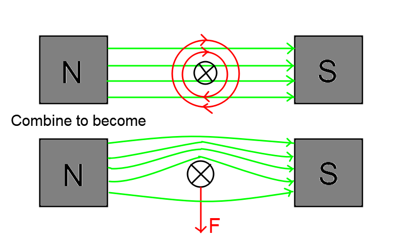

The Motor Effect
================

.. admonition:: Syllabus Excerpt

   **Inquiry Question:** Under what circumstances is a force produced on a current-carrying conductor in a magnetic field?

   * investigate qualitatively and quantitatively the interaction between a current-carrying conductor and a uniform magnetic field $F=lI_{\perp}B=lIB\sin\theta$ to establish: (ACSPH080, ACSPH081)   

     * conditions under which the maximum force is produced

     * the relationship between the directions of the force, magnetic field strength and current

     * conditions under which no force is produced on the conductor

   * conduct a quantitative investigation to demonstrate the interaction between two parallel current-carrying wires

   * analyse the interaction between two parallel current-carrying wires $\frac{F}{l} = \frac{\mu_0}{2\pi}\frac{I_1I_2}{r}$ and determine the relationship between the International System of Units (SI) definition of an ampere and Newton’s Third Law of Motion (ACSPH081, ACSPH106)   

    |syllabus-nesa|_

Current Carrying Wires in a Field
---------------------------------

Current-carrying conductors will experience a force due to the *Motor Effect*. 
This force is due to the interaction of the induced magnetic field around the conductor and the field produced by the magnet.

The force on a wire in a magnetic field is given by the following equation:

.. math::

  \begin{array}{ll}
    F = lI_{\perp}B & F = lIB\sin\theta 
  \end{array}

.. math::

  \begin{array}{llll}
    F & \text{Force (N)} & l & \text{Length of Conductor (m)} \\
    I & \text{Current through conductor (A)} & \theta & \text{Angle between current and field} \\
    B & \text{Magnetic Field Strength (T)} & & \\
  \end{array}

The maximum amount of force is produced when $\sin\theta = 1 \implies \theta = 90$,
i.e. when the direction of current is perpendicular to the field.

No force will act on the conductor when the direction of current is parallel to the field.
(this can be seen through $\sin\theta = 0$ when $\theta = 0$.

Investigation of Force Between Parallel Wires
---------------------------------------------

.. todo:: Do

Parallel Current-Carrying Wires
-------------------------------

Two parallel conductors will experience a force between them.
This force is because each conductor induces a magnetic field, which interact with each other.

When the current is flowing:

* in the **same** direction, the force is attractive
   .. image:: images/parallel-wire-attraction.png
      :align: center
      :width: 70%

* in the **opposite** direction, the force is repulsion.
   .. image:: images/parallel-wire-repulsion.png
      :align: center
      :width: 70%

By Newton's Third Law of Motion, these forces will be equal and opposite.

The magnitude of the force per unit length is given by:

.. math::

  \begin{array}{l}
    \frac{F}{l} = \frac{\mu_{0}}{2\pi} \frac{I_{1}I_{2}}{r} 
  \end{array}

.. math::

  \begin{array}{llll}
    F & \text{Force (N)} & l & \text{Length of Parallel Wire (m)} \\
    I & \text{Current through conductor (A)} & \mu_{0} & \text{Magnetic Permeability (N$A^{-2}$)} \\
    r & \text{Distance between conductors (m)} & & \\
  \end{array}

SI Definition of the Ampere
^^^^^^^^^^^^^^^^^^^^^^^^^^^

   One ampere is the constant current which, if maintained in two straight parallel conductors of infinite length,
   of negligible circular cross-section, and placed one metre apart in a vacuum, 
   would produce between those conductors a force equal to 2×$10^{−7}$ N$m^{-1}$ of length.

   -- `International Bureau of Weight and Measures <https://www.bipm.org/utils/common/pdf/si_brochure_8_en.pdf>`_.

.. math::

   \begin{align*}
      \frac{F}{l} = \frac{\mu_{0}}{2\pi} \frac{I_{1}I_{2}}{r}  \\
      2 \times 10^{-7} &= \frac{4\pi \times 10^{-7}}{2\pi} \times \frac{I^2}{1} \\
      I^2 &= \frac{2 \times 10^{-7} \times 2\pi}{4\pi \times 10^{-7}} \\
      I^2 &= 1 \\
      I &= 1 \text{ Ampere}
   \end{align*}